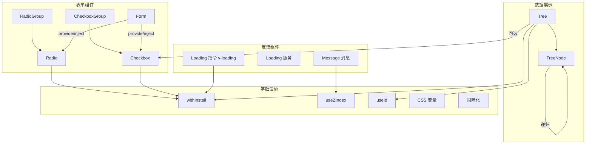

## 用户需求

为 x-design 组件库添加五个新组件：Radio、Checkbox、Loading、Message、Tree。

## 产品概述

x-design 是一个基于 Vue 3 + TypeScript 的 PC 端组件库，采用 Monorepo 架构。现有 9 个组件（Button、Input、Select、Form/FormItem、Table、Dialog、Tooltip、Popconfirm、ConfigProvider）。本次需求为组件库扩展五个常用组件，丰富表单交互、状态反馈和数据展示能力。

## 核心功能

### Radio 单选框

- XRadio 单选按钮：支持 v-model 双向绑定、label 值、disabled 禁用状态、size 尺寸
- XRadioGroup 单选组：通过 provide/inject 管理子 Radio 的选中状态，支持 v-model、disabled、size、change 事件
- 支持与 Form/FormItem 联动校验

### Checkbox 复选框

- XCheckbox 复选按钮：支持 v-model 双向绑定（boolean）、label 值、disabled 禁用、indeterminate 半选状态、size 尺寸
- XCheckboxGroup 复选组：通过 provide/inject 管理子 Checkbox 的选中状态（数组值），支持 v-model、disabled、min/max 限制选中数量、change 事件
- 支持与 Form/FormItem 联动校验

### Loading 加载

- 指令用法（v-loading）：在目标元素上添加遮罩层显示加载状态，支持自定义文案、背景色、自定义图标
- 服务用法：提供 XLoading.service() 方法，可命令式创建全屏或指定目标的 Loading 实例，返回 close() 方法
- 全屏加载：整个页面覆盖加载遮罩
- 加载动画：使用 CSS 旋转动画的圆环 spinner

### Message 消息提示

- 命令式调用：XMessage({ message, type, duration }) 或 XMessage.success/warning/info/error() 快捷方法
- 从页面顶部弹出，自动消失（默认 3 秒），支持手动关闭
- 多条 Message 依次堆叠显示，关闭后自动调整位置
- 支持 plain 朴素样式、自定义图标、HTML 内容、关闭回调

### Tree 树形控件

- 递归渲染树形数据结构（label、children）
- 支持展开/折叠节点、默认展开全部/指定节点
- 支持单选高亮当前节点（current-node）
- 支持复选框多选模式（show-checkbox），父子联动勾选
- 支持节点禁用（disabled）
- 提供 node-click、check-change、current-change 等事件
- 支持通过 node-key 唯一标识节点

## 技术栈

- 框架：Vue 3.3+ (Composition API, `<script setup>`)
- 语言：TypeScript 5.3+
- 样式：SCSS + CSS 变量（复用 `@x-design/theme`）
- 构建：Vite 5 + vite-plugin-dts
- 包管理：pnpm workspace Monorepo
- 工具库：`@x-design/utils`（withInstall）、`@x-design/components/_hooks`（useZIndex、useId）

## 实现方案

### 整体策略

严格遵循现有组件开发范式：每个组件目录包含 `index.ts`（withInstall 导出）、`types.ts`（类型定义）、`<Name>.vue`（SFC 实现）、`style.scss`（样式）。组件命名规范统一（XRadio、x-radio、--x-radio-*）。新增组件全部注册到 `packages/components/index.ts` 并补充 CSS 变量到 `packages/theme/index.scss`。

### 关键技术决策

1. **Radio/Checkbox 的 Group 模式**：采用 provide/inject 模式（与 Form 组件一致），Group 组件 provide 共享状态（modelValue、disabled、size、change 方法），子组件 inject 获取上下文。这样 Radio/Checkbox 既可独立使用也可在 Group 中使用。

2. **Loading 指令实现**：通过 Vue 自定义指令 `v-loading` 实现。在 `mounted` 钩子中创建 Loading DOM 并 append 到目标元素（需设置 position: relative），在 `updated` 钩子中响应绑定值变化控制显示/隐藏。服务式调用通过 `h()` + `render()` 动态创建 VNode 挂载到目标容器。

3. **Message 消息堆叠管理**：维护一个模块级的 `instances` 数组，每个 Message 实例通过 `render()` 创建独立容器挂载到 `document.body`。新消息计算 top offset 基于已有实例的累计高度。关闭时自动重新计算后续实例的 top 位置，实现平滑过渡。使用 `useZIndex` 管理层级。

4. **Tree 递归组件**：拆分为 XTree（容器组件，管理状态）和 XTreeNode（递归渲染节点）。Tree 通过 provide 向下传递 expandedKeys、checkedKeys、currentNodeKey 等响应式状态及操作方法。TreeNode 递归自身实现无限层级嵌套。复选框的父子联动通过递归遍历子树实现：勾选父节点自动勾选所有子节点，子节点全部勾选则父节点自动勾选。

### 性能考虑

- **Tree 组件**：对大数据量场景，节点展开/折叠使用 Set 存储 expandedKeys 以实现 O(1) 查找；复选联动采用自底向上冒泡更新避免全量遍历；递归组件使用 `v-show` 而非 `v-if` 避免频繁创建销毁 DOM（可配置）。
- **Message 组件**：实例数量上限（默认不超过屏幕可视范围），关闭时批量更新 offset 使用 requestAnimationFrame 合并重排。
- **Loading 指令**：复用已创建的 Loading DOM 实例，切换 display 而非反复创建/销毁。

## 实现注意事项

1. **provide/inject key 命名**：Radio 使用 `'xRadioGroup'`，Checkbox 使用 `'xCheckboxGroup'`，Tree 使用 `'xTree'`，与现有 Form 的 `'xForm'` 保持命名风格一致。

2. **表单联动**：Radio/Checkbox 在值变化时需触发 FormItem 的 validate（通过 inject `'xForm'` 获取 context，或通过事件冒泡）。参考现有 Input 组件 emit `update:modelValue` 的模式，FormItem 通过 watch fieldValue 自动触发校验。

3. **Loading 指令注册**：需在 `index.ts` 的 install 函数中通过 `app.directive('loading', vLoading)` 全局注册指令。

4. **Message 的 install 扩展**：参考 Dialog 的 confirm.ts 模式，将 Message 的静态方法挂载到 `app.config.globalProperties.$message`。

5. **国际化**：为 Loading 和 Tree 添加国际化 key（loading.text、tree.emptyText）到 zh-CN.ts 和 en.ts。

6. **CSS 变量**：新增组件特定变量到 `packages/theme/index.scss`，遵循 `--x-{component}-{property}` 命名规范。

## 架构设计

### 组件依赖关系



### 数据流

- **Radio/Checkbox**：`v-model` -> RadioGroup/CheckboxGroup provide -> Radio/Checkbox inject -> 更新选中状态 -> emit change -> FormItem watch 触发校验
- **Loading**：`v-loading="bool"` -> 指令 updated 钩子 -> 切换遮罩层显示 / `XLoading.service(options)` -> render VNode -> 返回 `{ close() }` 实例
- **Message**：`XMessage({ message, type })` -> 创建容器 -> render MessageComponent VNode -> 加入 instances 数组 -> 定时器到期 -> 关闭并重排偏移
- **Tree**：`data` prop -> Tree 扁平化处理 -> provide expandedKeys/checkedKeys -> TreeNode inject -> 递归渲染 -> 用户交互 -> 更新状态 -> emit 事件

## 目录结构

新增和修改的文件清单：

```
packages/
├── components/
│   ├── radio/
│   │   ├── index.ts          # [NEW] withInstall 包装 XRadio 和 XRadioGroup，导出组件和类型
│   │   ├── types.ts          # [NEW] RadioProps、RadioGroupProps、RadioGroupContext 类型定义
│   │   ├── Radio.vue         # [NEW] 单选按钮组件，支持 v-model、label、disabled、size，inject radioGroup 上下文
│   │   ├── RadioGroup.vue    # [NEW] 单选组容器，provide 选中值和 change 方法，管理子 Radio 状态
│   │   └── style.scss        # [NEW] Radio 样式，包含基础态、选中态、禁用态、不同尺寸、动画过渡
│   ├── checkbox/
│   │   ├── index.ts          # [NEW] withInstall 包装 XCheckbox 和 XCheckboxGroup，导出组件和类型
│   │   ├── types.ts          # [NEW] CheckboxProps、CheckboxGroupProps、CheckboxGroupContext 类型定义
│   │   ├── Checkbox.vue      # [NEW] 复选框组件，支持 v-model、label、disabled、indeterminate 半选态
│   │   ├── CheckboxGroup.vue # [NEW] 复选组容器，provide 选中数组和 change 方法，支持 min/max 限制
│   │   └── style.scss        # [NEW] Checkbox 样式，包含选中、半选、禁用状态动画
│   ├── loading/
│   │   ├── index.ts          # [NEW] 导出 vLoading 指令和 Loading 服务，install 中注册全局指令
│   │   ├── types.ts          # [NEW] LoadingOptions 类型定义（text、background、target、fullscreen 等）
│   │   ├── Loading.vue       # [NEW] Loading 遮罩层组件，包含 spinner 动画和文案
│   │   ├── directive.ts      # [NEW] v-loading 自定义指令实现（mounted/updated/unmounted 钩子）
│   │   ├── service.ts        # [NEW] Loading.service() 命令式创建逻辑，返回含 close() 的实例
│   │   └── style.scss        # [NEW] Loading 样式，spinner 旋转动画、遮罩层、全屏模式
│   ├── message/
│   │   ├── index.ts          # [NEW] 导出 XMessage 函数及 success/warning/info/error 快捷方法，install 挂载 $message
│   │   ├── types.ts          # [NEW] MessageProps、MessageOptions、MessageInstance 类型定义
│   │   ├── Message.vue       # [NEW] 单条消息组件，包含图标、内容、关闭按钮、进入/离开动画
│   │   ├── message.ts        # [NEW] 消息实例管理：instances 数组、创建/关闭/偏移计算逻辑
│   │   └── style.scss        # [NEW] Message 样式，四种类型配色、弹出动画、堆叠偏移
│   ├── tree/
│   │   ├── index.ts          # [NEW] withInstall 包装 XTree，导出组件和类型
│   │   ├── types.ts          # [NEW] TreeProps、TreeNodeData、TreeNode 内部类型、事件类型定义
│   │   ├── Tree.vue          # [NEW] 树容器组件，管理 expandedKeys/checkedKeys/currentNodeKey 状态，provide 给子节点
│   │   ├── TreeNode.vue      # [NEW] 树节点递归组件，渲染展开箭头、复选框、节点内容、子节点列表
│   │   ├── useTree.ts        # [NEW] Tree 核心逻辑 hook：节点展开/折叠、复选联动（父子级递归）、当前节点管理
│   │   └── style.scss        # [NEW] Tree 样式，缩进层级、展开动画、节点悬浮/选中/禁用状态
│   └── index.ts              # [MODIFY] 新增 XRadio/XRadioGroup/XCheckbox/XCheckboxGroup/XTree 注册和导出，新增 Loading 指令注册，新增 Message 方法导出
├── theme/
│   ├── index.scss            # [MODIFY] 添加 Radio/Checkbox/Loading/Message/Tree 的 CSS 变量
│   └── src/mixins/
│       ├── radio.scss        # [NEW] Radio mixin：radio-base、radio-checked、radio-disabled
│       ├── checkbox.scss     # [NEW] Checkbox mixin：checkbox-base、checkbox-checked、checkbox-indeterminate、checkbox-disabled
│       ├── loading.scss      # [NEW] Loading mixin：loading-overlay、loading-spinner
│       ├── message.scss      # [NEW] Message mixin：message-base、message-type-variant
│       └── tree.scss         # [NEW] Tree mixin：tree-node-base、tree-indent、tree-expand-icon
├── utils/
│   └── locale/
│       ├── zh-CN.ts          # [MODIFY] 添加 loading.text、tree.emptyText 国际化 key
│       └── en.ts             # [MODIFY] 添加对应英文翻译
docs/
└── components/
    ├── radio.md              # [NEW] Radio 组件文档，包含基础用法、单选组、禁用、尺寸、API 表格
    ├── checkbox.md           # [NEW] Checkbox 组件文档，包含基础用法、复选组、半选、限制数量、API
    ├── loading.md            # [NEW] Loading 组件文档，包含指令用法、全屏、自定义、服务式调用、API
    ├── message.md            # [NEW] Message 组件文档，包含基础用法、不同类型、可关闭、自定义时长、API
    └── tree.md               # [NEW] Tree 组件文档，包含基础用法、默认展开、复选框、禁用节点、API
```

## 关键代码结构

### Radio/Checkbox Group 的 provide/inject 上下文接口

```typescript
// radio/types.ts
interface RadioGroupContext {
  modelValue: Ref<string | number | boolean>;
  disabled: Ref<boolean>;
  size: Ref<'small' | 'medium' | 'large'>;
  changeEvent: (value: string | number | boolean) => void;
}

// checkbox/types.ts
interface CheckboxGroupContext {
  modelValue: Ref<(string | number)[]>;
  disabled: Ref<boolean>;
  size: Ref<'small' | 'medium' | 'large'>;
  min: Ref<number>;
  max: Ref<number>;
  changeEvent: (value: (string | number)[]) => void;
}
```

### Message 实例管理核心签名

```typescript
// message/types.ts
interface MessageOptions {
  message: string;
  type?: 'success' | 'warning' | 'info' | 'error';
  duration?: number;         // 默认 3000ms，0 为不自动关闭
  showClose?: boolean;
  offset?: number;           // 顶部偏移基准值，默认 16
  plain?: boolean;
  onClose?: () => void;
}

interface MessageInstance {
  id: string;
  close: () => void;
}

// message/message.ts - 函数签名
type MessageFn = (options: MessageOptions | string) => MessageInstance;
interface MessageApi extends MessageFn {
  success: (options: MessageOptions | string) => MessageInstance;
  warning: (options: MessageOptions | string) => MessageInstance;
  info: (options: MessageOptions | string) => MessageInstance;
  error: (options: MessageOptions | string) => MessageInstance;
  closeAll: () => void;
}
```

### Tree 节点数据结构

```typescript
// tree/types.ts
interface TreeNodeData {
  label: string;
  children?: TreeNodeData[];
  disabled?: boolean;
  [key: string]: any;        // 允许扩展自定义属性
}

interface TreeProps {
  data: TreeNodeData[];
  nodeKey?: string;           // 节点唯一标识字段名
  showCheckbox?: boolean;
  defaultExpandAll?: boolean;
  defaultExpandedKeys?: (string | number)[];
  defaultCheckedKeys?: (string | number)[];
  expandOnClickNode?: boolean;
  checkStrictly?: boolean;    // true 时父子不联动
  emptyText?: string;
}
```