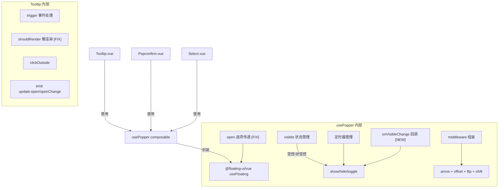

## 用户需求

对 Tooltip 组件进行全面问题分析和系统性重构，涵盖功能 Bug 修复、渲染策略改善、样式修复和文档补齐。

## 产品概述

Tooltip 是 x-design 组件库中的文字提示组件，用于鼠标悬停/点击/聚焦时显示提示信息。当前存在受控模式失效、性能浪费、渲染策略不合理、箭头样式缺陷等多层面问题。

## 核心功能

- 修复 usePopper 受控模式（open prop）下 show/hide 无法正确切换可见状态的功能 Bug
- 修复 useFloating 缺少 open 选项导致隐藏状态下持续执行 autoUpdate 的性能问题
- 改善 Tooltip 渲染策略，从"默认初始渲染全部 DOM"改为"首次显示后才创建 DOM"的懒渲染模式
- 修复箭头 ::before 伪元素定位缺少居中对齐导致各方向箭头位置偏移的样式问题
- 补齐文档中缺失的 API 描述（offset、enterable、open、openDelay、closeDelay、destroyTooltipOnHide、popperClass）

## 技术栈

- 框架：Vue 3 (Composition API) + TypeScript
- 定位库：@floating-ui/vue
- 样式：SCSS + CSS Variables
- 文档：VitePress (Markdown)

## 实现方案

### 策略选择

遵循项目已有模式（Popconfirm、Select 均直接使用 `usePopper` composable + 自写模板），不引入 `PopperTrigger`/`PopperContent` 子组件（项目中目前无任何组件实际使用它们，强行引入反而与其他组件模式不一致）。重点修复 `usePopper` 的核心 Bug，同时改善 Tooltip 自身的渲染策略和样式。

### 关键技术决策

**决策 1：usePopper 受控模式修复方案**

当前问题：`visible` 的 getter 在 `openRef.value !== undefined` 时直接返回外部 open 值，`show()`/`hide()` 修改的 `internalVisible` 被忽略。

方案：增加 `onVisibleChange` 回调选项。受控模式下 `show()`/`hide()` 不直接修改 `internalVisible`，而是调用 `onVisibleChange(true/false)` 通知消费者更新 `open` prop。非受控模式下行为不变。这样既保持了受控模式的语义正确性（状态由外部控制），又让 show/hide 能触发状态变更流程。

```typescript
// usePopper options 新增
onVisibleChange?: (visible: boolean) => void;

// show() 改造
const show = () => {
  if (disabledRef.value) return;
  clearTimers();
  const delay = openDelayRef.value;
  const doShow = () => {
    if (openRef.value !== undefined) {
      onVisibleChange?.(true); // 受控模式：通知外部
    } else {
      internalVisible.value = true; // 非受控：直接修改
    }
  };
  delay > 0 ? (openTimer = setTimeout(doShow, delay)) : doShow();
};
```

影响评估：Select 和 Popconfirm 均不传 `open` prop 也不传 `onVisibleChange`，修改完全不影响它们。

**决策 2：useFloating 传入 open 选项**

将 `visible` computed ref 传给 `useFloating` 的 `open` 选项，使 `whileElementsMounted` 的 `autoUpdate` 仅在浮层可见时运行，隐藏状态下不再持续计算定位。

```typescript
useFloating(referenceRef, floatingRef, {
  open: visible,  // 新增
  placement: placementRef,
  strategy: 'fixed',
  middleware,
  whileElementsMounted: autoUpdate,
});
```

这对所有使用 usePopper 的组件（Tooltip、Select、Popconfirm）都有正向性能影响。

**决策 3：Tooltip shouldRender 策略**

从当前的 `!props.destroyTooltipOnHide || popperVisible.value`（默认恒 true）改为 Popconfirm 风格的 `rendered` ref + watch 模式：

- 初始不渲染 DOM
- 首次 visible 变为 true 时设置 `rendered = true`
- 之后 DOM 一直保留（通过 v-show 控制显隐）
- `destroyTooltipOnHide` 模式：visible 为 false 时销毁 DOM

## 实现注意事项

1. **向后兼容**：usePopper 的修改必须确保不传 `open`/`onVisibleChange` 时行为完全不变，避免影响 Select 和 Popconfirm
2. **性能**：`useFloating` 添加 `open` 选项后，autoUpdate 仅在可见时运行，减少不必要的 DOM 观察和位置计算
3. **箭头修复**：`::before` 伪元素需要添加 `left: 50%; top: 50%; margin-left: -4px; margin-top: -4px;` 居中对齐
4. **类型安全**：`onVisibleChange` 为可选回调，TS 类型需正确声明

## 架构设计



## 目录结构

```
packages/components/
├── _internal/popper/
│   └── usePopper.ts       # [MODIFY] 修复受控模式 Bug：新增 onVisibleChange 回调、传 open 给 useFloating、受控模式下 show/hide 通过回调通知外部。确保 Select/Popconfirm 不受影响。
├── tooltip/
│   ├── Tooltip.vue         # [MODIFY] 重构渲染策略：改用 rendered ref + watch 懒渲染；接入 onVisibleChange 回调处理受控模式事件；精简事件处理函数。
│   ├── style.scss          # [MODIFY] 修复箭头样式：::before 伪元素添加居中定位；补充各方向箭头 ::before 的偏移修正。
│   └── types.ts            # 无需修改，现有 Props 定义已完整
└── docs/components/
    └── tooltip.md          # [MODIFY] 补齐 API 文档：新增 offset、enterable、open、openDelay、closeDelay、destroyTooltipOnHide、popperClass 等 Props 说明和 Events 说明。
```

## 关键代码结构

```typescript
// usePopper.ts - 新增的选项接口
export interface UsePopperOptions {
  placement?: MaybeRef<Placement>;
  offset?: MaybeRef<number>;
  showArrow?: MaybeRef<boolean>;
  openDelay?: MaybeRef<number>;
  closeDelay?: MaybeRef<number>;
  disabled?: MaybeRef<boolean>;
  open?: MaybeRef<boolean | undefined>;
  matchWidth?: MaybeRef<boolean>;
  onVisibleChange?: (visible: boolean) => void; // 新增：受控模式状态变更通知
}
```