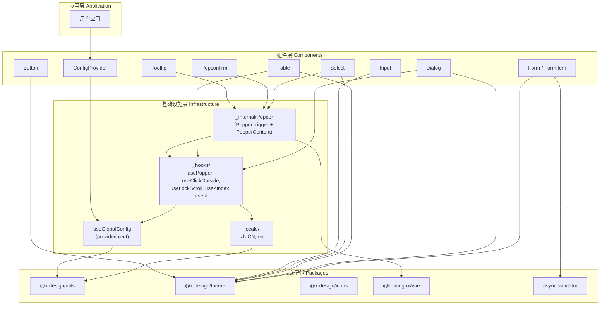

## 用户需求

对 x-design 组件库进行全面审查和架构改进，对标 antd，重点提升 Table、Form 校验、Dialog、Tooltip 四个组件的易用性和适用场景广度。

## 产品概述

x-design 是一个基于 Vue 3 + TypeScript 的 PC 端组件库，当前有 8 个基础组件（Button、Input、Select、Table、Dialog、Tooltip、Popconfirm、Form）。需要在不破坏现有 API 兼容性的前提下，建立公共基础设施层，并对核心组件进行增强重构，使其达到接近 antd 的功能完备度和易用性。

## 核心特性

### 1. 基础设施建设

- 统一 Popper 弹出层组件：将 Tooltip/Popconfirm/Select 中重复的 `@floating-ui/vue` 定位逻辑抽取为可复用的 Popper 基础组件
- 公共 Composables 层：提取 `useClickOutside`、`useLockScroll`、`useZIndex`、`useId`、`useLocale` 等通用 hooks
- ConfigProvider 全局配置组件：提供统一的 size、locale、zIndex 等全局配置能力
- 国际化基础方案：替换组件中硬编码的中文文案

### 2. Tooltip 重构

- 基于新 Popper 组件重构，消除重复代码
- 新增受控模式（open / onOpenChange）
- 新增 destroyTooltipOnHide 配置
- 新增 openDelay / closeDelay 延迟控制

### 3. Dialog 增强

- 将命令式 API 从 `createApp` 改为 `render(h(...))` 方式，共享全局上下文
- 新增 `Dialog.info()`、`Dialog.success()`、`Dialog.warning()`、`Dialog.error()` 快捷方法
- 新增 `confirmLoading` 异步确认支持
- 新增 `beforeClose` 关闭前回调钩子

### 4. Form 校验增强

- 引入 `async-validator` 库，支持 20+ 种内置校验规则类型
- 完善异步校验支持
- 新增 `validateTrigger` 在 Form 级别设置默认触发时机
- Form-Input 联动：blur 时自动触发 FormItem 校验

### 5. Table 组合式重构

- 将 559 行单文件拆分为 composables 架构
- 新增列筛选功能（column.filters + column.onFilter）
- 新增内置分页支持
- 列配置支持 render 函数
- 固定列增加滚动阴影指示

### 6. 级联更新

- Popconfirm 和 Select 基于新 Popper 基础组件重构

## 技术栈

- **框架**：Vue 3 (Composition API) + TypeScript
- **构建**：Vite 5 + vite-plugin-dts
- **样式**：SCSS + CSS Variables（复用现有主题系统）
- **弹出层定位**：@floating-ui/vue（已有依赖）
- **表单校验**：async-validator（新增依赖）
- **测试**：Vitest + @vue/test-utils（已配置）
- **包管理**：pnpm workspace Monorepo

## 实现方案

### 总体策略

采用「先基础后上层、先通用后具体」的分层推进策略。先建立 Composables 和 Popper 基础设施，再依次重构 Tooltip、Dialog、Form、Table，最后级联更新 Popconfirm 和 Select。每一步保持向后兼容，所有现有 Props/Events API 不变，仅新增能力。

### 关键技术决策

**决策 1：Popper 基础组件设计**

当前 Tooltip（186行）、Popconfirm（138行）、Select（380行）三者各自重复实现了完整的 `@floating-ui/vue` 调用 + Teleport + clickOutside + Transition 逻辑。抽取为 `_internal/popper/` 下的三件套：

- `usePopper` composable：封装 `useFloating` + middleware 配置 + 箭头定位计算
- `PopperTrigger.vue`：触发器容器，绑定 hover/click/focus 事件
- `PopperContent.vue`：浮动内容容器，包含 Teleport + Transition + Arrow

这样 Tooltip 只需约 40 行，Popconfirm 约 50 行，Select 弹出层约 20 行。

**决策 2：useClickOutside 统一化**

当前三个组件（Tooltip、Popconfirm、Select）各自在 onMounted 中手动 `document.addEventListener('click', ...)` 实现点击外部关闭。提取为 `useClickOutside(elementRefs, callback)` composable，避免内存泄漏和逻辑重复。

**决策 3：Form 校验引入 async-validator**

当前 FormItem.vue 的 `validateRule` 手写了 5 种规则（required/min/max/pattern/validator），且 validator 的回调式 API 不支持 async。引入 `async-validator`（antd 和 Element Plus 共同使用的校验库），可直接获得 20+ 种内置规则 + 完善的异步校验 + 国际化错误消息。FormItemRule 类型扩展 `type` 字段（email/url/number/integer/date 等），同时保持现有 `required/min/max/pattern/validator` 的完全兼容。

**决策 4：Dialog 命令式 API 重构**

当前 `confirm.ts` 使用 `createApp()` 创建独立 App 实例。改为 `render(h(Dialog, props), container)` 方式：

- 优点：无需新建 App 实例，共享宿主 App 的全局插件/组件/provide
- 使用 `appContext` 参数传递当前 App 上下文

**决策 5：Table 组合式拆分**

将 559 行的 Table.vue 按关注点拆分为独立 composables：

- `useSelection.ts`：全选/单选/indeterminate 逻辑（约80行）
- `useSorter.ts`：排序状态管理 + 数据排序（约60行）
- `useExpand.ts`：展开行/树形展开逻辑（约70行）
- `useTree.ts`：树形数据扁平化 + 层级计算（约50行）
- `useFilter.ts`：筛选逻辑（新增功能）
- `useColumns.ts`：列配置处理 + render 函数支持（约40行）

Table.vue 主文件降至约 200 行，仅负责模板和组合各 composable。

**决策 6：ConfigProvider 实现**

通过 Vue 3 的 `provide/inject` 机制，ConfigProvider 向下注入全局配置。各组件通过 `useGlobalConfig()` hook 读取配置，支持嵌套覆盖。配置项包括：

- `size`：全局尺寸（small/medium/large）
- `zIndex`：弹出层起始 z-index
- `locale`：国际化文案
- `namespace`：CSS 类名前缀

**决策 7：国际化方案**

采用轻量级方案：在 `@x-design/utils` 中新增 `locale/` 模块，定义 `zh-CN` 和 `en` 两个语言包。通过 ConfigProvider 的 `locale` prop 切换。组件内通过 `useLocale()` hook 获取当前语言文案。不引入 vue-i18n 等重量级库。

## 实现注意事项

### 向后兼容

- 所有现有 Props、Events、Expose 方法的签名保持不变
- 新增的 Props 均有合理默认值，不影响现有使用方式
- Form 的 `FormItemRule` 类型新增 `type` 字段为可选，现有规则定义无需修改
- Dialog `confirm()` 函数签名不变，仅内部实现改为 render 方式

### 性能考量

- Popper 组件使用 `autoUpdate` 仅在 visible 时激活，避免隐藏状态持续计算
- Table composables 使用 `computed` 惰性求值，仅在依赖变化时重新计算
- useClickOutside 使用事件委托模式，单个 listener 管理多个组件
- Dialog 命令式 API 改为 render 后，避免重复创建 App 实例的开销

### 日志和错误处理

- Form 校验错误通过 validateState + validateMessage 传递，不使用 console 输出
- async-validator 错误消息与现有 `rule.message` 自定义消息优先级一致
- ConfigProvider 缺失时所有 hook 返回合理默认值，不 throw

## 架构设计

### 系统架构



### 数据流

- **ConfigProvider**: `props.size/locale/zIndex` --provide--> 所有子组件 --inject--> `useGlobalConfig()` 返回合并后配置
- **Popper**: Trigger 事件 --> `usePopper` 管理 visible 状态 --> `@floating-ui/vue` 计算位置 --> PopperContent 渲染
- **Form 校验**: 用户输入 --> Input emit --> FormItem 监听 --> async-validator 执行规则 --> 更新 validateState/Message
- **Table 排序**: 点击表头 --> `useSorter` 更新 sortState --> `computed` 重新排序数据 --> 模板重渲染

## 目录结构

```
packages/components/
├── _hooks/                              # [NEW] 公共 Composables 层
│   ├── index.ts                         # [NEW] hooks 统一导出
│   ├── useClickOutside.ts               # [NEW] 点击外部检测 hook。接收元素 refs 数组和回调函数，统一管理 document click 监听器，自动在 onBeforeUnmount 清理。替代 Tooltip/Popconfirm/Select 中各自手写的 handleClickOutside
│   ├── useLockScroll.ts                 # [NEW] 滚动锁定 hook。Dialog 打开时锁定 body 滚动，支持嵌套计数（多个 Dialog 叠加时只在最后一个关闭时解锁）。替代 Dialog.vue 中简单的 overflow hidden 实现
│   ├── useZIndex.ts                     # [NEW] 全局 z-index 管理 hook。维护自增计数器，每次调用 nextZIndex() 返回递增值。从 ConfigProvider 读取初始值
│   ├── useId.ts                         # [NEW] 唯一 ID 生成 hook。为无障碍 aria 属性提供稳定的唯一标识符
│   └── useLocale.ts                     # [NEW] 国际化 hook。从 ConfigProvider 注入的 locale 中读取组件文案，提供 t(key) 翻译函数
│
├── _internal/                           # [NEW] 内部基础组件层
│   └── popper/                          # [NEW] 统一弹出层基础组件
│       ├── index.ts                     # [NEW] 导出 PopperTrigger、PopperContent、usePopper
│       ├── usePopper.ts                 # [NEW] Popper 核心 composable。封装 @floating-ui/vue 的 useFloating + middleware 配置，管理 visible 状态、延迟定时器、箭头位置计算
│       ├── PopperTrigger.vue            # [NEW] 触发器容器组件。绑定事件，根据 trigger prop 决定激活方式
│       ├── PopperContent.vue            # [NEW] 浮动内容组件。包含 Teleport + Transition + Arrow 渲染
│       └── types.ts                     # [NEW] Popper 相关类型定义
│
├── config-provider/                     # [NEW] ConfigProvider 全局配置组件
│   ├── ConfigProvider.vue               # [NEW] 全局配置提供者。通过 provide 向下注入配置，支持嵌套覆盖
│   ├── index.ts                         # [NEW] 导出 XConfigProvider
│   └── types.ts                         # [NEW] ConfigProviderProps 类型定义
│
├── tooltip/
│   ├── Tooltip.vue                      # [MODIFY] 基于 Popper 基础组件重构，新增 open 受控模式、destroyTooltipOnHide、openDelay/closeDelay
│   ├── types.ts                         # [MODIFY] 新增相关 props 定义
│   ├── index.ts                         # 不变
│   └── style.scss                       # 不变
│
├── dialog/
│   ├── Dialog.vue                       # [MODIFY] 新增 confirmLoading、beforeClose 支持，滚动锁定改用 useLockScroll
│   ├── confirm.ts                       # [MODIFY] 从 createApp 改为 render 方式，新增 info/success/warning/error 快捷方法
│   ├── types.ts                         # [MODIFY] 新增 confirmLoading、beforeClose、DialogMethodOptions 类型
│   ├── index.ts                         # [MODIFY] 导出新增方法，挂载到 $dialog
│   ├── global.d.ts                      # [MODIFY] 更新类型声明
│   └── style.scss                       # [MODIFY] 新增相关样式
│
├── form/
│   ├── Form.vue                         # [MODIFY] 新增 validateTrigger prop
│   ├── FormItem.vue                     # [MODIFY] 校验引擎替换为 async-validator，支持 type 规则、异步校验
│   ├── types.ts                         # [MODIFY] FormItemRule 扩展 type 字段，validator 支持 Promise
│   ├── index.ts                         # 不变
│   └── style.scss                       # 不变
│
├── table/
│   ├── Table.vue                        # [MODIFY] 重构为约 200 行，逻辑拆分到 composables
│   ├── composables/                     # [NEW] Table composables 目录
│   │   ├── index.ts                     # [NEW] 统一导出
│   │   ├── useSelection.ts             # [NEW] 选择逻辑
│   │   ├── useSorter.ts                # [NEW] 排序逻辑
│   │   ├── useExpand.ts                # [NEW] 展开行逻辑
│   │   ├── useTree.ts                  # [NEW] 树形数据逻辑
│   │   ├── useFilter.ts               # [NEW] 筛选逻辑（新功能）
│   │   └── useColumns.ts              # [NEW] 列配置处理 + render 函数支持
│   ├── TableFilter.vue                 # [NEW] 筛选下拉面板组件
│   ├── types.ts                         # [MODIFY] 新增 filters/onFilter/render/pagination 等字段
│   ├── index.ts                         # 不变
│   └── style.scss                       # [MODIFY] 新增筛选、固定列阴影、分页样式
│
├── popconfirm/
│   ├── Popconfirm.vue                   # [MODIFY] 基于 Popper 基础组件重构
│   └── ...                              # 其余不变
│
├── select/
│   ├── Select.vue                       # [MODIFY] 弹出层迁移到 Popper 基础组件
│   └── ...                              # 其余不变
│
├── index.ts                             # [MODIFY] 新增导出 XConfigProvider
│
packages/utils/
├── index.ts                             # [MODIFY] 新增导出 locale 模块
├── locale/                              # [NEW] 国际化模块
│   ├── index.ts                         # [NEW] 统一导出
│   ├── zh-CN.ts                         # [NEW] 中文语言包
│   └── en.ts                            # [NEW] 英文语言包
├── with-install.ts                      # 不变
└── typescript.ts                        # 不变
```

## 关键代码结构

### Popper Composable 接口

```typescript
// packages/components/_internal/popper/types.ts
import type { Placement } from '@floating-ui/vue';

export interface PopperProps {
  placement?: Placement;
  trigger?: 'hover' | 'click' | 'focus';
  offset?: number;
  showArrow?: boolean;
  enterable?: boolean;
  openDelay?: number;
  closeDelay?: number;
  disabled?: boolean;
  destroyOnHide?: boolean;
}

// packages/components/_internal/popper/usePopper.ts 返回类型
export function usePopper(
  referenceRef: Ref<HTMLElement | undefined>,
  floatingRef: Ref<HTMLElement | undefined>,
  arrowRef: Ref<HTMLElement | undefined>,
  options: PopperProps
): {
  visible: Ref<boolean>;
  floatingStyles: Readonly<Ref<CSSProperties>>;
  arrowStyles: ComputedRef<CSSProperties>;
  actualPlacement: Readonly<Ref<Placement>>;
  show: () => void;
  hide: () => void;
  toggle: () => void;
};
```

### ConfigProvider 注入类型

```typescript
// packages/components/config-provider/types.ts
export interface ConfigProviderProps {
  size?: 'small' | 'medium' | 'large';
  zIndex?: number;
  locale?: Record<string, any>;
  namespace?: string;
}

export const CONFIG_PROVIDER_KEY: InjectionKey<ComputedRef<ConfigProviderProps>>;
```

### Table Column 扩展类型

```typescript
// packages/components/table/types.ts 新增
export interface TableColumn {
  // ... 现有字段保持不变
  filters?: Array<{ text: string; value: any }>;
  onFilter?: (value: any, row: any) => boolean;
  filterMultiple?: boolean;
  filteredValue?: any[];
  render?: (params: { row: any; column: TableColumn; $index: number }) => VNode | string;
}

export interface TablePagination {
  current?: number;
  pageSize?: number;
  total?: number;
  pageSizes?: number[];
  onChange?: (current: number, pageSize: number) => void;
}
```

## Agent Extensions

### SubAgent

- **code-explorer**
- 用途：在实现每个阶段时，检索现有组件代码模式、验证文件路径、确认依赖关系
- 预期结果：确保修改方案准确对齐现有代码结构，避免引入不一致模式